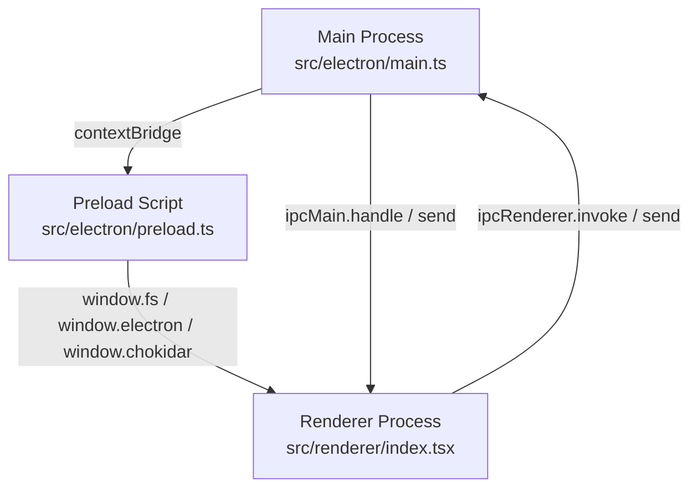
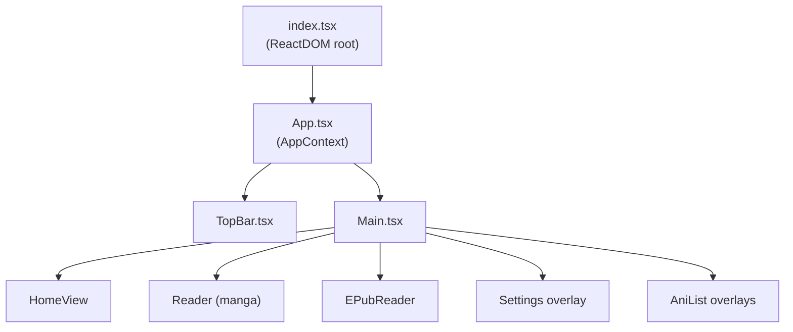
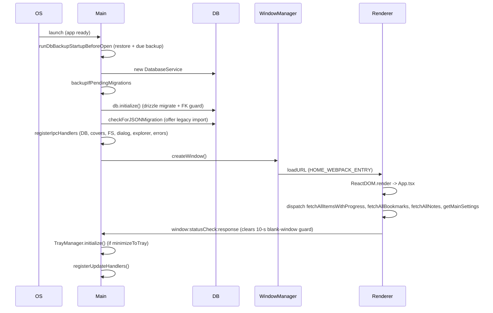

# Yomikiru — Architecture Overview

> Last updated: 2026-08-22. Covers v2.24.x.

Yomikiru is an offline Electron desktop app (Windows + Linux) for reading manga/comics and EPUB novels.
No server component; all data lives on the user's machine.

---

## Table of Contents

- [Yomikiru — Architecture Overview](#yomikiru--architecture-overview)
  - [Table of Contents](#table-of-contents)
  - [Tech Stack](#tech-stack)
  - [Process Model](#process-model)
  - [Directory Map](#directory-map)
  - [IPC Bridge](#ipc-bridge)
  - [Renderer Entry \& Context](#renderer-entry--context)
  - [Redux Store](#redux-store)
  - [Startup Sequence](#startup-sequence)
  - [Multi-Window](#multi-window)
  - [System Tray](#system-tray)
  - [Logging](#logging)
  - [Error Handling](#error-handling)
  - [Build \& Packaging](#build--packaging)

---

## Tech Stack

| Layer | Technology |
| --- | --- |
| Desktop shell | Electron 22 (Chromium 108) |
| UI framework | React 17, Redux Toolkit 1.9 |
| Styling | SCSS modules + CSS custom properties (themes) |
| Database | SQLite via `better-sqlite3`, ORM via `drizzle-orm` |
| Schema migrations | `drizzle-kit` (migration files in `drizzle/`) |
| Schema validation | Zod |
| File watching | Chokidar (exposed to renderer via preload) |
| EPUB package parse | Shared `fast-xml-parser` OPF/NCX/nav adapter in `src/common/epub/`; chapter HTML rewrite in `src/renderer/utils/epub.ts` |
| PDF rendering | `pdfjs-dist` (web worker in renderer) |
| Image processing | `sharp` (main-process only, for cover WebP generation) |
| Auto-updater | Custom; GitHub Releases API + `electron-dl` + shared HTTP client (`src/common/http`, axios) |
| Icons | Font Awesome 6 (SVG-core) |
| Virtualised lists | `@tanstack/react-virtual` |
| Type checking | TypeScript 5, Biome linter/formatter |
| Testing | Vitest + RTL (unit), Playwright (E2E) |
| Bundler | Webpack 5 via `@electron-forge/plugin-webpack` |

---

## Process Model



**Main process** owns:

- `DatabaseService` (`src/electron/db/index.ts`) — SQLite via drizzle
- `WindowManager` (`src/electron/util/window.ts`) — BrowserWindow lifecycle
- `TrayManager` (`src/electron/util/tray.ts`) — system tray icon
- `MainSettings` (`src/electron/util/mainSettings.ts`) — persist/apply; schema and defaults live in `src/common/mainSettings.ts` (hardware acceleration, temp path, tray, single-instance, updates, **library folders**)
- Library scan engine (`src/electron/util/libraryScan.ts`) — Scan now / start / interval / watch, status broadcast, cancel
- `Updater` (`src/electron/updater.ts`) — GitHub releases polling
- IPC handler registrations (covers, DB, dialogs, FS, explorer, library scan, updates)

There are two settings stores: `settings.json` (renderer app settings) and `main-settings.json` (`MainSettings`). Library scan roots and Default Location live only in MainSettings. Do not read `settings.json` from main for scan config.

**`src/common`** is imported by both processes. It must not import Node builtins (`node:path`, `fs`, ...) or Electron. Each process installs fs/path once (`setLibraryIo` / `libraryIo()`); classify still takes a per-call `LibraryIo` for fake trees.

**Preload** exposes a secure surface to the renderer:

- `window.fs` — async/sync filesystem subset (read, write, stat, rm, mkdir, existsSync, isDir, isFile). `isDir` / `isFile` follow directory and file symlinks by default.
- `window.path` — path utilities (join, basename, extname, sep…)
- `window.electron` — app info, clipboard, shell, webFrame zoom, currentWindow events, typed IPC (`.invoke` / `.send` / `.on`)
- `window.chokidar` — single-path file watcher returning a cleanup function
- `window.process` — platform, arch, build info (commit, date, build type), isPortable
- `window.getFonts` — font-list library
- `window.logger` / `window.createRendererLogSink` — electron-log sinks (only consumed by `src/renderer/utils/logger.ts`)

The typed IPC contract is defined once in [`src/common/types/ipc.ts`](../src/common/types/ipc.ts).
All channel names, request shapes, and response shapes live there.

---

## Directory Map

```
src/
├── common/           # Shared by main + renderer: no Node builtins, no Electron (setLibraryIo)
│   ├── http.ts             axios HTTP client (main + renderer); no fetch
│   ├── epub/               Shared fast-xml-parser EPUB package parse (OPF / NCX / nav; no chapter HTML)
│   ├── library/            Shared library classify / folders / images / formats (main + renderer)
│   ├── mainSettings.ts     MainSettings Zod schema and defaults (no Electron)
│   ├── types/
│   │   ├── ipc.ts          IPC channel union
│   │   ├── db.ts           DB-level types (LibraryItem, Progress, Bookmark…)
│   │   └── legacy.ts       Pre-SQLite history/bookmark shapes for migration
│   └── logger/             Cross-process Logger class
│
├── electron/         # Main process
│   ├── main.ts             Entry: registers IPC handlers, creates first window
│   ├── preload.ts          contextBridge surface
│   ├── db/
│   │   ├── schema.ts       Drizzle table definitions (source of truth for DB shape)
│   │   ├── index.ts        DatabaseService class (all DB queries)
│   │   ├── legacyNormalize.ts  Pre-migration backfill (chapterName, dedupe)
│   │   └── validator.ts    Zod validators for DB input
│   ├── ipc/
│   │   ├── covers.ts       covers:materialize / deleteForLibraryId / clearCache
│   │   ├── database.ts     All db:* handlers + change-notification pings
│   │   ├── dialog.ts       dialog:error / warn / confirm / showOpenDialog …
│   │   ├── explorer.ts     Windows "Open with" context-menu integration
│   │   ├── fs.ts           fs:unzip / fs:showInExplorer / fs:saveFile / fs:fileChanged
│   │   ├── libraryScan.ts  libraryScan:start / cancel / getStatus / status; anilist:claimStartupImport
│   │   ├── reader.ts       reader:loadLink / reader:recordPage (m2r pushes)
│   │   ├── update.ts       update:check:manual
│   │   └── errorReporting.ts  error:report handler
│   └── util/
│       ├── window.ts       WindowManager (create, close, cleanup, error check)
│       ├── tray.ts         TrayManager (minimize-to-tray, hide-all, left-click toggle)
│       ├── mainSettings.ts MainSettings persist (schema: src/common/mainSettings.ts)
│       ├── libraryScan.ts  Process-wide library walk, watch, interval, cancel
│       ├── libraryFs.ts    Preload-shaped fs adapter (symlink follow)
│       ├── contentSource.ts Shared folder / packed-archive extraction and first-image source
│       ├── coverMaterialize.ts  sharp WebP pipeline (userData/covers/<id>.webp)
│       ├── migrate.ts      JSON -> SQLite migration (bookmarks.json / history.json)
│       ├── logger.ts       createMainLogger (electron-log scoped sinks)
│       └── errorHandler.ts Global uncaught exception capture + issue report dialog
│
├── renderer/         # Renderer (React)
│   ├── index.tsx           ReactDOM.render root
│   ├── App.tsx             Root component: AppContext, IPC listeners, drag-drop
│   ├── Main.tsx            Mounts HomeView, MangaReader, EPubReader, Settings, AniList overlays
│   ├── TopBar.tsx          Custom title bar: page input, home/settings buttons, win controls
│   ├── components/         Shared reusable components
│   │   ├── ListNavigator.tsx    Keyboard-navigable + virtualised list with search (see below)
│   │   ├── ListItem.tsx         Classic-view row
│   │   ├── ContextMenu.tsx      Custom right-click menu
│   │   └── ui/                  Primitive UI: Modal, Popover, InputRange, InputColor, SelectionCheckbox …
│   ├── features/
│   │   ├── home/           Home screen (Classic + Gallery)
│   │   ├── reader/         Manga reader + EPUB reader + shared hooks/services
│   │   ├── settings/       Settings overlay (tabs: Settings, Shortcuts, Themes, About, Extras)
│   │   └── anilist/        AniList login, search, progress editing
│   ├── hooks/              Shared hooks (useMultiSelect, useSelectionShortcuts, useKeybindings…)
│   ├── store/              Redux slices (one file per slice)
│   └── utils/              Pure helpers (epub, pdf, keybindings, color, gallerySort, libraryCover…)
│
└── test/             # Test harness
    ├── mocks/preload.ts    Typed preload mock (onInvoke, stubFs, installPreloadMocks)
    ├── renderWithProviders.tsx  RTL helper with Redux store
    └── fixtures/           Sample libraryItem fixtures
```

---

## IPC Bridge

All IPC is typed end-to-end via the `IPCChannels` union in [`src/common/types/ipc.ts`](../src/common/types/ipc.ts).
That file is the canonical reference for every channel name, request shape, and response shape — read it directly rather than duplicating the list here.

Direction conventions: most channels are `r2m` (renderer invokes main). `m2r` channels are one-way pushes from main to renderer. The `direction` field on each `ChannelDefinition` makes this explicit.

One non-obvious channel: `fs:fileChanged` is a main-process push sent whenever any window writes a watched JSON config file (settings, themes, shortcuts, readerPresets). Renderers skip self-echoes by comparing `sourceWindowId` against `window.electron.currentWindow.id()` — see [`src/renderer/App.tsx`](../src/renderer/App.tsx) around the `fs:fileChanged` listener.

---

## Renderer Entry & Context



`App.tsx` provides **`AppContext`** — the shared surface used by child components to:

- `openInReader(link, opts)` — validate and open a file/folder in the appropriate reader
- `closeReader()` — flush progress, clean up temp dirs, reset Redux reader state
- `openInNewWindow(link)` — send `window:openLinkInNewWindow` IPC
- `setContextMenuData` / `setOptSelectData` / `setColorSelectData` — drive the global context menu / select overlay
- `pageNumberInputRef` / `bookProgressRef` — refs shared between TopBar inputs and readers

`App.tsx` also owns:

- App-level keyboard and mouse shortcuts (navToHome, openSettings, uiSizeUp/Down/Reset)
- Drag-and-drop file opening
- Custom stylesheet injection (`appSettings.customStylesheet`)
- IPC listeners for `reader:loadLink`, DB-change pings, `mainSettings:sync`, `fs:fileChanged`
- The `window.contextMenu.template` factory (defines standard context-menu entries reused everywhere)

---

## Redux Store

Defined in [`src/renderer/store/index.ts`](../src/renderer/store/index.ts). Each slice is a single file under `src/renderer/store/` — see that directory for the full slice list. The slice names in the root reducer (`appSettings`, `readerPresets`, `theme`, `bookmarks`, `bookNotes`, `library`, `prevNextChapter`, `shortcuts`, `anilist`, `ui`, `reader`, `mainSettings`) map directly to the file names.

One non-obvious piece: `readerPresetsAutosaveMiddleware` in [`src/renderer/store/readerPresetsAutosaveMiddleware.ts`](../src/renderer/store/readerPresetsAutosaveMiddleware.ts) intercepts `setReaderSettings` / `setEpubReaderSettings` actions and — when the active preset has `autosave: true` — automatically writes the changed settings back into that preset without any user action.

---

## Startup Sequence



---

## Multi-Window

`WindowManager` in [`src/electron/util/window.ts`](../src/electron/util/window.ts) tracks all `BrowserWindow` instances in a parallel array.

- **New window**: `Ctrl+N` or taskbar jump-list "New Window" creates a fresh BrowserWindow.
- **Single-instance (packaged)**: `app.requestSingleInstanceLock()`. On second launch, main checks `openInExistingWindow` (`MainSettings`):
  - **true** → focuses last open window, sends `reader:loadLink` if a file path was passed.
  - **false** → opens a new window.
- **Open with**: `--new-window` flag in second-instance args always opens a new window regardless.
- **Cross-window config sync**: when any window writes `settings.json`, `themes.json`, `shortcuts.json`, or `readerPresets.json` via `fs:saveFile`, main pushes `fs:fileChanged` to all windows. Each renderer reloads only when the relevant setting changed and `syncSettings`/`syncThemes` is enabled.
- **Window close**: sends `reader:recordPage` (IPC m2r) → renderer saves progress → sends `window:destroy` → main destroys the window. A 5-second safety fallback destroys without waiting.
- **Temp dir cleanup**: before closing, main deletes any `window:addDirToDelete` path registered for that window (extracted EPUB/ZIP temp dirs).
- **App-wide vs window-local**: each window has its own renderer, Redux store, and module-level variables. SQLite and on-disk settings are shared. Library scan, folder watch, interval polls, and DB backups run **only in main**. Renderers invoke `libraryScan:start` / `cancel` / `getStatus` and listen for `libraryScan:status` plus `db:*:change`. A renderer `setInterval` / `let lock` is per window. Reader progress is window-local on purpose.

---

## System Tray

`TrayManager` in [`src/electron/util/tray.ts`](../src/electron/util/tray.ts) — enabled via `MainSettings.minimizeToTray`.

- **Minimize** → hides window to tray (instead of OS taskbar minimise).
- **Tray left-click**:
  - Single window: toggles show/hide.
  - Multiple windows: restores last hidden window; if none hidden, focuses last focused window.
- **Tray context menu**: lists each window by title (truncated at 50 chars), plus "Hide all Windows" and "Exit".
- `TrayManager.setMinimizeToTray(bool)` is called live when the setting changes.

---

## Logging

Three logging layers, all backed by `electron-log`:

| Layer | Entry point | Scope convention |
| --- | --- | --- |
| Main process | `createMainLogger("scope")` in `src/electron/util/logger.ts` | `"main"`, `"db"`, `"WindowManager"`, etc. |
| Renderer | `createRendererLogger("scope")` in `src/renderer/utils/logger.ts` | `"App"`, `"manga/Reader"`, `"epub/EPubReader"`, etc. |
| Preload | internal via `setupPreloadLogging` | feeds into the renderer logger transport |

Only `src/renderer/utils/logger.ts` is allowed to call `window.createRendererLogSink` directly.
All renderer code must use `createRendererLogger`. See [`src/renderer/utils/logger.ts`](../src/renderer/utils/logger.ts).

---

## Error Handling

`src/electron/util/errorHandler.ts` provides a global `ErrorHandler` singleton:

- Catches uncaught exceptions and unhandled promise rejections in main.
- Emits a "Report Issue" menu item and dialog that lets users file a GitHub issue with context info.
- Severity levels: `low`, `medium`, `high`, `critical`.
- Renderer reports critical errors back to main via `error:report` IPC.

---

## Build & Packaging

Built with `electron-forge` + `webpack`. Key commands (see `package.json`):

```
pnpm dev              # Start dev server (hot reload)
pnpm make:win64       # Squirrel installer + ZIP for Windows x64
pnpm make:deb         # .deb + ZIP for Linux
pnpm drizzle:generate # Regenerate drizzle migration files after schema changes
pnpm test             # Vitest unit tests
pnpm test:db          # DB integration tests (temp SQLite)
pnpm test:e2e         # Playwright smoke tests
```

`drizzle/` — SQL migration files. Packed into the app bundle and applied at startup by `DatabaseService.initialize()`.
Covers (`userData/covers/<id>.webp`) are outside the bundle — generated at runtime by `sharp`.
