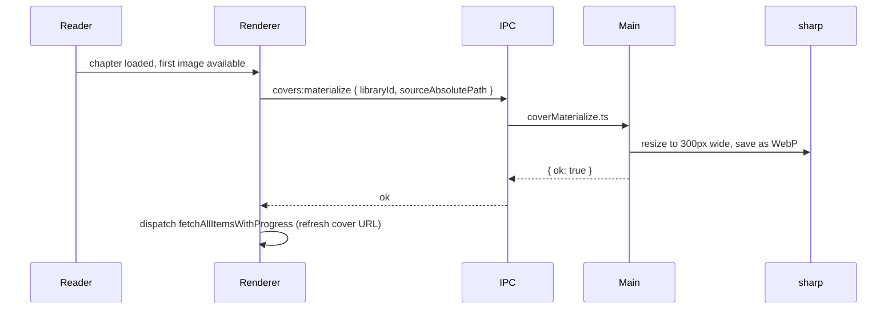

# Yomikiru — Library, Progress, Bookmarks & Cover System

> Last updated: 2026-08-09. Covers v2.24.x.

All user data (library catalogue, reading progress, bookmarks, notes) is stored in a single
SQLite database file at `userData/data.db`. The ORM is Drizzle.

---

## Table of Contents

- [Yomikiru — Library, Progress, Bookmarks \& Cover System](#yomikiru--library-progress-bookmarks--cover-system)
  - [Table of Contents](#table-of-contents)
  - [Database Schema](#database-schema)
  - [Library Items](#library-items)
  - [Reading Progress](#reading-progress)
    - [Manga Progress](#manga-progress)
    - [Book Progress](#book-progress)
  - [Bookmarks](#bookmarks)
    - [Manga Bookmarks](#manga-bookmarks)
    - [Book Bookmarks](#book-bookmarks)
    - [Redux Bookmarks Slice](#redux-bookmarks-slice)
  - [Book Notes (Highlights)](#book-notes-highlights)
  - [Cover System](#cover-system)
    - [Flow](#flow)
  - [Redux Library Slice](#redux-library-slice)
  - [Legacy Migration (JSON -\> SQLite)](#legacy-migration-json---sqlite)
  - [Schema Migrations (Drizzle)](#schema-migrations-drizzle)
    - [Migration 0001 — FK guard](#migration-0001--fk-guard)
    - [Pre-migration normalisation](#pre-migration-normalisation)
  - [Verify / Troubleshoot](#verify--troubleshoot)

---

## Database Schema

Source of truth: [`src/electron/db/schema.ts`](../src/electron/db/schema.ts).

```mermaid
erDiagram
    library_items {
        int id PK
        text link UK "folder or .epub path"
        text type "manga | book"
        text title
        int updatedAt
        int createdAt
        text author
        text cover "absolute path or null"
    }
    manga_progress {
        text itemLink PK FK
        text chapterName
        int currentPage
        text chaptersRead "JSON string[]"
        int totalPages
        int lastReadAt
    }
    book_progress {
        text itemLink PK FK
        text chapterId
        text chapterName
        text position "CSS selector"
        int lastReadAt
    }
    manga_bookmarks {
        int id PK
        text itemLink FK
        text chapterName
        int page
        text note
        int createdAt
    }
    book_bookmarks {
        int id PK
        text itemLink FK
        text chapterName
        text chapterId
        text position "CSS selector"
        text note
        int createdAt
    }
    book_notes {
        int id PK
        text itemLink FK
        text chapterId
        text chapterName
        text range "JSON {startPath,startOffset,endPath,endOffset}"
        text content "user annotation"
        text selectedText
        text color
        int createdAt
        int updatedAt
    }

    library_items ||--o| manga_progress : "one"
    library_items ||--o| book_progress : "one"
    library_items ||--o{ manga_bookmarks : "many"
    library_items ||--o{ book_bookmarks : "many"
    library_items ||--o{ book_notes : "many"
```

All children cascade-delete when a `library_items` row is removed
(SQLite `ON DELETE CASCADE`). See the [migration guard note below](#schema-migrations-drizzle).

---

## Library Items

A "library item" is:

- **manga** (`type = "manga"`) — a directory that contains image chapters, or a directly readable file (CBZ/ZIP/PDF).
- **book** (`type = "book"`) — an `.epub` file.

`link` is the absolute filesystem path and is the natural key. `id` is an auto-increment integer used for the cover system.

Items are added to the library automatically the first time a file/folder is opened in either reader.
They are never deleted automatically — only via explicit user action (context menu "Remove" / gallery bulk-delete).

When the path on disk is missing, gallery details and classic History/Bookmark open flows offer
**Locate on disk…** (`db:library:relocateItem`) to rewrite `library_items.link` and every child
`itemLink` while keeping the same `id`, or remove the entry / bookmark. A name mismatch between the
chosen path and the previous basename or library title asks for confirmation before relocating.

The `cover` column stores either:

- `null` — no cover assigned; the library grid shows the first letter of the title.
- An absolute path to a custom cover image — set by the user via "Set Cover" in the details panel.
- **Not** the WebP path — the materialize cache is kept separate (see [Cover System](#cover-system)).

IPC surface: all `db:library:*` channels in [`src/common/types/ipc.ts`](../src/common/types/ipc.ts).
Implementation: [`src/electron/db/index.ts`](../src/electron/db/index.ts), methods `addLibraryItem`,
`updateLibraryItem`, `deleteLibraryItem`, `relocateLibraryItem`, `getAllLibraryItemsWithProgress`.

---

## Reading Progress

### Manga Progress

One row per `library_item`. Fields:

| Field | Meaning |
| --- | --- |
| `chapterName` | Basename of the last-opened chapter directory or file |
| `currentPage` | 1-based page number within the chapter |
| `totalPages` | Total image count for the chapter (updated on chapter load) |
| `chaptersRead` | JSON array of chapter basenames the user has ever finished |
| `lastReadAt` | Unix ms timestamp of last read |

Progress is saved:

- When the reader navigates to a new page (throttled).
- When `closeReader()` is called (flushes to DB via `updateCurrentItemProgress` thunk).
- When the window closes (`reader:recordPage` IPC).

`chaptersRead` is appended when `currentPage >= totalPages` (end of chapter) and can be marked/unmarked manually via context menu in the chapter list.

IPC: `db:manga:updateProgress`, `db:manga:updateChaptersRead`, `db:manga:updateChaptersReadAll`.

### Book Progress

One row per `library_item`. Fields:

| Field | Meaning |
| --- | --- |
| `chapterId` | EPUB spine id of the chapter |
| `chapterName` | Display name (from TOC, if available) |
| `position` | CSS query string identifying the scroll position element |
| `lastReadAt` | Unix ms timestamp |

Position is computed by scanning the visible iframe content for the topmost element in the viewport and building a CSS path. See `makeScrollPos` in the EPubReader and `getCSSPath` in [`src/renderer/utils/utils.ts`](../src/renderer/utils/utils.ts).

The renderer keeps `bookProgressRef` as a React ref (`src/renderer/App.tsx`) so `flushEpubScrollPos` can be called before closing to avoid losing scroll position from race conditions.

IPC: `db:book:updateProgress`, `db:book:getProgress`.

---

## Bookmarks

### Manga Bookmarks

Stored in `manga_bookmarks`. Unique constraint: `(itemLink, chapterName, page)`.

Created via:

- The `b` keybinding in the manga reader.
- Right-click → "Add to Bookmarks" on the page.

Fields: `itemLink`, `chapterName` (chapter basename), `page` (1-based), `note` (optional text), `createdAt`.

Displayed in:

- Classic Home → Bookmark Tab.
- Manga Reader side-list → Bookmarks tab.
- Gallery → MangaDetailsPanel → Bookmarks tab.

IPC: `db:manga:addBookmark`, `db:manga:deleteBookmarks`, `db:manga:getBookmarks`.

### Book Bookmarks

Stored in `book_bookmarks`. Unique constraint: `(chapterId, position)`.

Created via the floating "Bookmark" button in the EPUB reader side-list.
`position` is a CSS selector path to the scroll anchor.

Displayed in:

- Classic Home → Bookmark Tab (with EPUB badge).
- EPUB Reader side-list → Bookmarks tab.
- Gallery → BookDetailsPanel → Bookmarks tab.

IPC: `db:book:addBookmark`, `db:book:deleteBookmarks`, `db:book:getBookmarks`.

### Redux Bookmarks Slice

[`src/renderer/store/bookmarks.ts`](../src/renderer/store/bookmarks.ts) — loads all bookmarks on startup via `fetchAllBookmarks` thunk,
then keeps them in memory. Individual add/remove dispatches go straight to IPC and update the store.
Change pings from main (`db:bookmark:change`) trigger a full re-fetch for cross-window sync.

---

## Book Notes (Highlights)

Stored in `book_notes`. Unique constraint: `(chapterId, range, selectedText)`.

Notes are highlighted text selections inside the EPUB reader.

Fields:

- `chapterId` — EPUB spine id
- `chapterName` — for display
- `range` — `{ startPath, startOffset, endPath, endOffset }` (JSON). Paths are CSS selector strings produced by `highlightUtils.getPathFromNode` in [`src/renderer/utils/highlight.ts`](../src/renderer/utils/highlight.ts).
- `selectedText` — the raw selected string
- `content` — optional user annotation text
- `color` — hex string (one of the `DEFAULT_HIGHLIGHT_COLORS`)

Flow:

1. User selects text in EPUB iframe → "Add Note" button appears in side-list.
2. Selecting a color triggers `addNote(color)` in `EPubReader.tsx`.
3. Range is serialised via `highlightUtils`; stored via `db:book:addNote` IPC.
4. On chapter load, stored ranges are re-applied with `highlightUtils.applyHighlight`.

IPC: `db:book:addNote`, `db:book:updateNote`, `db:book:deleteNotes`, `db:book:getAllNotes`.
Redux: [`src/renderer/store/bookNotes.ts`](../src/renderer/store/bookNotes.ts).

---

## Cover System

Library thumbnails are WebP files stored in `userData/covers/<libraryId>.webp`, generated by `sharp` in the main process.

### Flow



- **Source resolution**: [`src/renderer/utils/libraryCoverSources.ts`](../src/renderer/utils/libraryCoverSources.ts) — `resolveMangaCoverSourcePath` checks for a dedicated `cover.*` file in the manga root, falls back to the first page image.
- **Service layer**: [`src/renderer/utils/libraryCoverService.ts`](../src/renderer/utils/libraryCoverService.ts) — `materializeMangaLibraryThumbnail`, `materializeBookLibraryThumbnail`, `materializeBookCoverFromExtractedPath`, `pickAndApplyCustomCover`.
- **Reader flow**: [`src/renderer/features/reader/services/readerCoverFlows.ts`](../src/renderer/features/reader/services/readerCoverFlows.ts) — `applyMangaCoverAfterChapterLoad` and `applyMakeCoverFromPageImage` coordinate the reader-triggered cover updates.
- **Custom cover**: user can right-click a page in the manga reader → "Set as Cover", or use the "Pick Cover" button in the details panel.
- **Cache clear**: `covers:clearCache` IPC removes all files under `userData/covers/` and recreates the empty directory.

The `library_items.cover` column stores only user-picked non-WebP paths (e.g. a `cover.jpg` in the manga root). The WebP thumbnail at `userData/covers/<id>.webp` is separate and not stored in the DB — the renderer resolves it from the library item `id` at render time via `libraryCoverSrc` in [`src/renderer/utils/libraryCover.ts`](../src/renderer/utils/libraryCover.ts).

---

## Redux Library Slice

[`src/renderer/store/library.ts`](../src/renderer/store/library.ts) maintains `items: Record<string, LibraryItemWithProgress | null>` keyed by `link`.

Key thunks:

| Thunk | Purpose |
| --- | --- |
| `fetchAllItemsWithProgress` | Loads entire library + progress from DB |
| `addLibraryItem` | Adds/upserts item; triggers cover flow |
| `updateCurrentItemProgress` | Writes current reader progress to DB (flush on close) |
| `updateMangaProgress` | Mid-read progress update |
| `updateBookProgress` | EPUB scroll position update |
| `deleteLibraryItem` | DB delete (cascades bookmarks/notes) + store removal |
| `updateChaptersRead` | Toggle one chapter read/unread |
| `updateChaptersReadAll` | Mark all chapters read/unread |

---

## Legacy Migration (JSON -> SQLite)

Before v2.19.7 the library and bookmarks were stored in `userData/bookmarks.json` and `userData/history.json`.

On first launch after upgrade, `checkForJSONMigration` in [`src/electron/util/migrate.ts`](../src/electron/util/migrate.ts) detects these files and offers a one-time migration dialog.
If accepted:

1. Backs up `data.db` with a timestamp.
2. Calls `db.migrateFromJSON(history, bookmarks)`.
3. Renames old JSON files to `.old`.

The old files are never deleted automatically; they remain as `.old` backups.

---

## Schema Migrations (Drizzle)

Migration files live in `drizzle/` and are applied at startup by `DatabaseService.initialize()`.

### Migration 0001 — FK guard

Migration 0001 rebuilds `library_items` via DROP + RENAME. SQLite `PRAGMA foreign_keys` is ignored
inside a Drizzle-managed transaction, which means a plain `DROP TABLE library_items` would cascade-delete
all children. The guard:

1. Checks whether `library_items` already has the `id` column (if yes, 0001 already ran — skip).
2. If 0001 is pending, sets `PRAGMA foreign_keys = OFF` on the connection **before** `migrate()` opens its transaction.
3. After `migrate()` completes (in the `finally` block), restores `PRAGMA foreign_keys = ON`.

See [`src/electron/db/index.ts` lines 57-77](../src/electron/db/index.ts).

### Pre-migration normalisation

`normalizeLegacyMangaDataBeforeMigration` in [`src/electron/db/legacyNormalize.ts`](../src/electron/db/legacyNormalize.ts) runs before `migrate()`:

- Backfills `manga_bookmarks.chapterName` from the old `link` column when missing or `"~"`.
- Deduplicates `manga_bookmarks` rows on the new `(itemLink, chapterName, page)` key (keeps `MIN(id)`).
- Backfills `manga_progress.chapterName` from the old `chapterLink` column.

This is safe to re-run (idempotent) — it early-exits if the old columns are already absent.

---

## Verify / Troubleshoot

Manual checks after a version upgrade:

- Open any manga and verify the chapter list shows history (green read indicators).
- Confirm bookmarks still appear in the side-list.
- For EPUB: open a book and verify the previous scroll position is restored.
- If covers are blank after upgrade: right-click any item in the gallery → "Refresh Cover" or "Set as Cover".

Commands:

```
pnpm test:db          # Run DB integration tests against a temp SQLite file
pnpm drizzle:studio   # Open Drizzle Studio UI to inspect data.db directly
```
