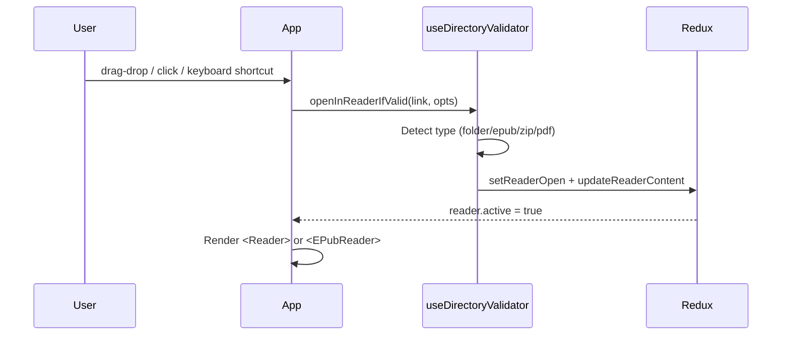

# Reader Feature

> Last updated: 2026-08-09. Covers v2.24.x.

Yomikiru has two separate reader implementations mounted side-by-side in `Main.tsx`:

- **Manga Reader** — image-based (manga, manhwa, webtoon, comics, CBZ/ZIP archives, PDF).
- **EPUB Reader** — HTML-chapter-based (novels, comics in EPUB format).

Both share the same Redux `reader` slice, `appSettings`, keyboard shortcut system, AniList bar, and zen mode.

Entry points:

- Manga Reader: [`manga/Reader.tsx`](manga/Reader.tsx)
- EPUB Reader: [`epub/EPubReader.tsx`](epub/EPubReader.tsx)
- Shared hooks/services: [`hooks/`](hooks/) and [`services/`](services/)

---

## Table of Contents

1. [How a File is Opened](#how-a-file-is-opened)
2. [Reader Redux Slice](#reader-redux-slice)
3. [Manga Reader](#manga-reader)
4. [EPUB Reader](#epub-reader)
5. [PDF Support](#pdf-support)
6. [Shared Keyboard Shortcuts](#shared-keyboard-shortcuts)
7. [Zen Mode](#zen-mode)
8. [Side List](#side-list)
9. [Reader Presets](#reader-presets)
10. [Smooth Scroll](#smooth-scroll)
11. [Directory Validator](#directory-validator)

---

## How a File is Opened



`useDirectoryValidator` in [`hooks/useDirectoryValidator.ts`](hooks/useDirectoryValidator.ts):

- If `link` is a directory → manga reader (after checking for at least one image).
- If `link` ends in `.epub` → EPUB reader.
- If `link` ends in `.zip` / `.cbz` → extract to temp dir, then open as manga.
- If `link` ends in `.pdf` → render pages to canvas, then open as manga.
- Optional `opts.epubChapterId` / `opts.epubElementQueryString` / `opts.mangaPageNumber` for restoring a saved position.

The reader is hidden (not unmounted) while the home view is visible — the `display: none` toggle is done in `Main.tsx` and `HomeView`. This avoids remounting the heavy reader DOM on each open.

---

## Reader Redux Slice

[`src/renderer/store/reader.ts`](../../store/reader.ts)

State shape (simplified):

```
reader: {
  active: boolean
  loading: string | null        // null = not loading, string = what is being loaded
  link: string                  // current file/folder path
  type: "manga" | "book" | null
  mangaPageNumber: number       // chapter-open page target (not live scroll progress)
  content: {
    type: "manga" | "book"
    title: string
    progress: MangaProgress | BookProgress | null
    ...
  } | null
}
```

Key actions:

- `setReaderOpen(link)` — activates the reader.
- `resetReaderState()` — clears everything; called on close.
- `setReaderLoading(msg)` / stop — shows a loading overlay.
- `updateReaderContent(content)` — sets the content descriptor after chapter load.
- `updateReaderMangaCurrentPage(n)` — page tick during scrolling.
- `updateReaderBookProgress({chapterId, position})` — EPUB scroll anchor.
- `getReaderBook` selector — typed view of reader state when `type === "book"`.
- `getReaderManga` selector — typed view when `type === "manga"`.

---

## Manga Reader

Entry: [`manga/Reader.tsx`](manga/Reader.tsx) (~1500 lines — planned to be split into hooks).

### Reading Modes

Controlled by `appSettings.readerSettings.readerTypeSelected`:

| Value | Mode |
| --- | --- |
| `0` | Vertical scroll (webtoon / manhwa) |
| `1` | Horizontal left-to-right (Western comics) |
| `2` | Horizontal right-to-left (traditional manga) |

### Pages per Row

`pagesPerRowSelected`:

- `0` — one image per row.
- `1` — two images per row.
- `2` — two images per row, first row is single (cover-page mode).

Reading side (`readingSide`): `0` = LTR, `1` = RTL. Affects which image appears on which side in two-page mode.

### Image Layout and Sizing

Images are loaded as `` elements (or `<canvas>` in canvas-mode).

- Wide-image detection: images wider than a threshold are placed alone on a row even in two-page mode.
- **Fit options** (`fitOption`): none, fit-vertically, fit-horizontally, 1:1.
- **Max width / max height**: limits applied per-image.
- **Reader width**: overall container width in percent of viewport.
- **Variable image size**: allows images in the same chapter to have different widths.
- **Canvas-based reader** (`useCanvasBasedReader`): renders images to `<canvas>` for slightly sharper output on HiDPI displays at the cost of more memory.

### Image Row Construction

After loading images (`checkForImgsAndLoad`):

1. Images are loaded into `imageData[]` (with `isWide` classification).
2. Rows are built into `imageRow[]` where each row holds the indices of one or two images from `imageData`.
3. The reader renders `imageRow` via `IntersectionObserver` to track the "current page" as the user scrolls.

`IntersectionObserver` is used (via `react-intersection-observer`) to fire `setCurrentPageNumber` as rows scroll into view.

### Scroll Behaviour

- Scroll A (`scrollDown`/`scrollUp`) — small scroll step (`scrollSpeedA`).
- Scroll B (`largeScroll`/`largeScrollReverse`) — large scroll step (`scrollSpeedB`).
- `overrideMouseWheelSpeed` — custom wheel speed (`mouseWheelScrollDuration`, `mouseWheelScrollSpeed`).
- Grab-to-scroll: holding mouse button and dragging.
- Smooth scroll hook: [`hooks/useSmoothScroll.ts`](hooks/useSmoothScroll.ts) — RAF-based interpolation on a given scroll container ref.

### Chapter Navigation

- Previous / next chapter: `setReaderState` on the sibling path with `mangaPageNumber` 1 (chapter-open target). Manga `Reader` stays mounted, so live page state still reflects the previous viewport. A dedicated open-page ref plus a pending flag apply that target after `imageRow` (and canvas attach) exists and `[data-pagenumber]` is queryable; viewport detection stays off until then. The loading overlay stays up until that scroll so Continue / bookmarks do not flash page 1.
- Chapter list comes from the manga root directory sorted by the configured sort method.
- **Random chapter** (`r` key): picks a chapter from the list, biased away from the last `RECENT_CHAPTERS_SIZE = 10` recently-opened chapters.
- **Shuffle mode**: session-only full shuffle of the chapter list; prev/next follows the shuffled order until shuffle is disabled.
- **Search persistence**: "Fix search" toggle keeps the side-list filter active across chapter navigations.
- After the last page, a chapter-transition screen appears (unless `disableChapterTransitionScreen` is on).

### Page Number Input

The TopBar contains a page number `<input>` (`pageNumberInputRef`). Typing a number and pressing Enter scrolls to that page. `f` key shortcut focuses it.

### Bookmarking in Manga Reader

The `b` key or side-list "Add Bookmark" button bookmarks the current page.
Bookmarks are shown in the side-list Bookmarks tab.
Right-clicking an image shows "Add to Bookmarks" and "Set as Cover" context menu entries.

### Color Filter

`customColorFilter` in reader settings: an RGBA overlay div with configurable blend mode applied over the reading area. Separate from `invertImage`, `grayscale`, `forceLowBrightness` (independent toggles).
Hue/saturation/brightness/contrast adjustments are applied as CSS filters.

### Dynamic Loading

`dynamicLoading`: when enabled, images are loaded lazily as they scroll into view. Reduces initial memory usage for long chapters.

### ZIP / Archive Support

`.cbz` and `.zip` files are extracted to a temp directory before the reader loads them.
The temp dir is registered via `window:addDirToDelete` and deleted when the window closes (or when `keepExtractedFiles` is false, it is also deleted on reader close).

---

## EPUB Reader

Entry: [`epub/EPubReader.tsx`](epub/EPubReader.tsx).

### EPUB Parsing

`EPUB` class in [`src/renderer/utils/epub.ts`](../../utils/epub.ts):

1. Extracts the `.epub` file (ZIP) to a temp directory.
2. Parses `container.xml` → `content.opf` → manifest, spine, metadata.
3. Parses `toc.ncx` and EPUB3 nav document for the TOC tree.
4. Resolves stylesheet paths.

If `keepExtractedFiles` is enabled, the extracted folder is reused on subsequent opens (identified by a `SOURCE` file containing the original EPUB path).

### HTML Rendering

Each EPUB spine item is rendered as an `<HTMLPart>` component ([`epub/HTMLPart.tsx`](epub/HTMLPart.tsx)):

- Injects EPUB stylesheets via `<StyleSheets>` ([`epub/StyleSheets.tsx`](epub/StyleSheets.tsx)).
- Applies reader background settings (content frame, page background, wallpaper).
- Handles internal EPUB links (relative paths resolved against the spine).
- Intercepts `<a>` clicks to navigate to another spine item or scroll to a fragment.
- Footnote links open a modal (`FootNodeModal`) instead of navigating away.

`loadOneChapter` mode: only the current chapter is rendered in the DOM (lower memory). Scrolling to the next chapter changes `currentChapter.index`.

### EPUB Stylesheets and Color Override

[`epub/StyleSheets.tsx`](epub/StyleSheets.tsx) injects each stylesheet from `epubData.styleSheets`.

When `epubReaderSettings.overrideColors` is enabled, the reader's font, link, page background, and content background colors replace those from the EPUB's own CSS. This uses a separate injected stylesheet that overrides body/html selectors (scoped to the content container to avoid affecting the app chrome).
CSS `url()` references and `@font-face` are resolved relative to the extracted path.

### Background / Wallpaper

EPUB reader background layers:

- **Page background** (`epubReaderSettings.pageBackground`) — the outermost reader area colour.
- **Content background** (`epubReaderSettings.contentBackground`) — the reading text area background.
- **Wallpaper image** — custom image with dim, brightness, and contrast controls.
- **Layer overlay** — additional colour overlay on top of content.
- **Content frame settings** ([`epub/components/ContentFrameSettings.tsx`](epub/components/ContentFrameSettings.tsx)) — inline padding, border, content background separate from page background.

Wallpaper applies to the content area and remains fixed when zooming text.

### Position Tracking

Position is tracked as a CSS selector string pointing to the topmost visible element in the viewport.
`makeScrollPos` scans `document.elementsFromPoint` at the top of the scroll area.
On chapter load, `setProgressPosition(queryString)` restores the scroll anchor.

Book progress percentage (`[0-100]`) is shown in the TopBar progress input and derived from spine index / total spine length.

### Find in Page

[`epub/components/FindInPage.tsx`](epub/components/FindInPage.tsx) — searches the rendered HTML content for a string using the browser's `querySelector` and highlight logic. Forward/backward navigation moves through matches.

### Notes and Highlights

When text is selected in the EPUB content:

1. The selection range is captured.
2. User picks a highlight color from the palette.
3. `addNote(color)` in `EPubReader` serialises the range and calls `db:book:addNote`.
4. On chapter re-render, stored notes are replayed via `highlightUtils.applyHighlight`.
5. Notes list ([`epub/components/NotesList.tsx`](epub/components/NotesList.tsx)) shows all notes for the current book; clicking one navigates to the chapter and scrolls to the highlight.

Highlight colors: `DEFAULT_HIGHLIGHT_COLORS` in [`src/renderer/utils/highlight.ts`](../../utils/highlight.ts) (yellow, red, blue, green, purple, pink...).

---

## PDF Support

[`src/renderer/utils/pdf.ts`](../../utils/pdf.ts)

PDFs are pre-rendered to PNG canvas images in a web worker (`pdfjs-dist`). The rendering pipeline:

1. `renderPDF(link, renderPath, scale)` — renders each page to a canvas and exports it as a PNG into `renderPath` (a temp dir).
2. The resulting PNG files are loaded by the manga reader as a normal image chapter.

`pdfScale` in reader settings controls the resolution (higher = better quality, more memory).
Password-protected PDFs show an error dialog.

---

## Shared Keyboard Shortcuts

Both readers share the same shortcut command map. The full list of commands with default keys and human-readable names is in `SHORTCUT_COMMAND_MAP` inside [`src/renderer/utils/keybindings.ts`](../../utils/keybindings.ts) — read that directly rather than duplicating it here.

Notable non-obvious bindings:

- `` ` `` (backtick) — toggle zen mode / fullscreen
- `r` — open random chapter (manga only; biased away from recent chapters)
- `Alt+.` / `Alt+,` — cycle presets forward / backward
- `Alt+1`–`5` — jump to preset by slot
- `mouse4` / `mouse5` — previous / next page (mouse side buttons, fully supported)

---

## Zen Mode

Zen mode hides all chrome except the reading area (side list, title bar, settings panel).

- Activated via the `` ` `` key or the TopBar button.
- On entering, the window goes fullscreen (if not already).
- `showPageNumberInZenMode` in manga reader settings shows a small page counter overlay.
- `hideCursorInZenMode` in app settings hides the cursor after a delay.

---

## Side List

### Manga Side List

[`manga/components/ReaderSideList.tsx`](manga/components/ReaderSideList.tsx)

Slides in from the left. Displays:

- **Chapter list** — all siblings in the manga root, filtered by search. Each row shows name, page count, read indicator, and progress bar.
- **Bookmark list** ([`manga/components/BookmarkList.tsx`](manga/components/BookmarkList.tsx)) — all bookmarks for the current manga.
- AniList bar.
- Prev/next chapter buttons, random chapter button, shuffle toggle.
- Sort button (name/date, normal/inverse) and refresh sit to the right of the chapter search field.
- "Fix search" toggle — keeps the filter active when changing chapters.
- Pin button — pins the side list open (shifts the reading area).

Resizable: drag the edge to adjust `sideListWidth` (persisted in reader settings).

### EPUB Side List

[`epub/EPubReaderSideList.tsx`](epub/EPubReaderSideList.tsx)

Three tabs:

- **Content** ([`epub/components/ContentList.tsx`](epub/components/ContentList.tsx)) — TOC tree. Clicking navigates to that spine item.
- **Bookmarks** ([`epub/components/BookmarkList.tsx`](epub/components/BookmarkList.tsx)) — book bookmarks; clicking navigates to chapter + position.
- **Notes** ([`epub/components/NotesList.tsx`](epub/components/NotesList.tsx)) — text highlights/annotations; clicking navigates to the note location.
- Find-in-page input ([`epub/components/FindInPage.tsx`](epub/components/FindInPage.tsx)).
- AniList bar.
- Bookmark button for adding a position bookmark.

---

## Reader Presets

Both readers support named setting presets stored in `userData/readerPresets.json`. For the full preset system description — autosave middleware, import/export, repair-on-load, and the `User` preset invariant — see [`docs/settings.md#reader-presets`](../../../docs/settings.md#reader-presets-readerpresetsjson).

Managed by: [`src/renderer/store/readerPresets.ts`](../../store/readerPresets.ts) and [`src/renderer/utils/readerPresets.ts`](../../utils/readerPresets.ts).

The UI section in the reader settings panel is [`reader/components/ReaderPresetSection.tsx`](components/ReaderPresetSection.tsx).

---

## Smooth Scroll

[`hooks/useSmoothScroll.ts`](hooks/useSmoothScroll.ts)

Attaches to a scroll container ref and intercepts keyboard-driven scroll events.
Uses RAF (requestAnimationFrame) with deceleration to produce smooth scroll animation.
Applied to the main reader area when the side list is not pinned; switches to the inner image container when pinned.

---

## Directory Validator

[`hooks/useDirectoryValidator.ts`](hooks/useDirectoryValidator.ts) / [`services/directoryValidator.ts`](services/directoryValidator.ts)

`validateDirectory(path)` checks whether a path contains readable images (up to `maxSubdirectoryDepth` levels deep).
`openInReaderIfValid(link, opts)` — the main entry point called everywhere (context menus, history clicks, drag-drop, IPC link load).

Returns `true` if the path was opened, `false` if it was invalid (invalid paths may open an error dialog).
