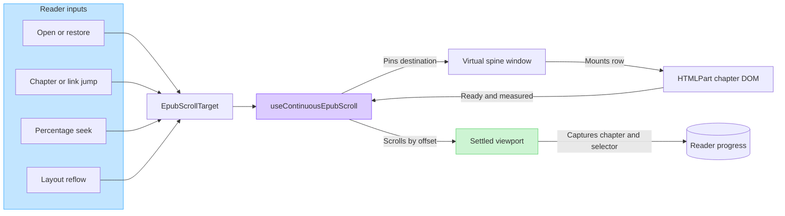
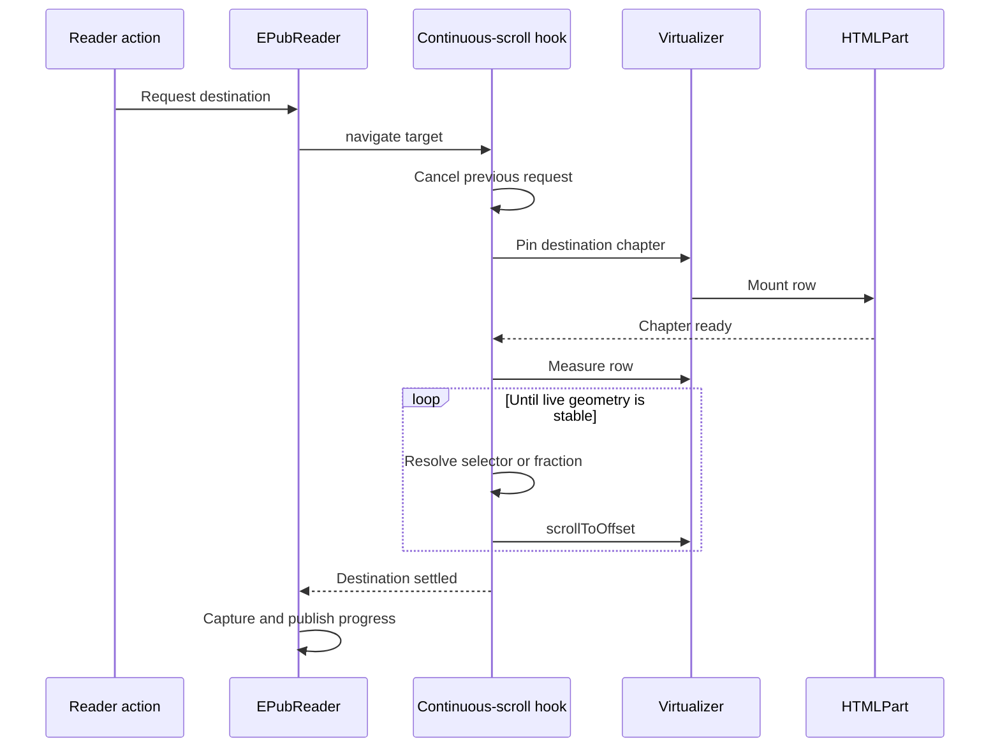
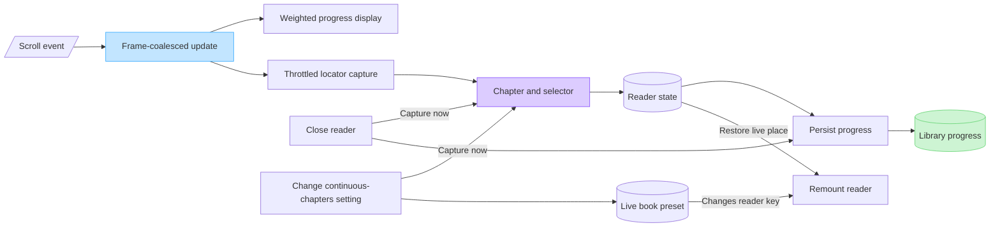

# EPUB continuous chapter flow

Continuous chapters keep an EPUB reader session alive across spine boundaries. The current book renderer presents that session as one vertically scrollable book while mounting only the chapters needed around the viewport. Chapter-at-a-time reading remains the default and keeps its separate behavior.

The setting describes chapter handoff, not a display direction. A future paged reader can use the same capability to advance into the next chapter without rebuilding the reader, even though it does not render one vertical strip.

## User-visible behavior

- Enable **Continuous chapters (experimental)** from the in-reader book settings.
- The choice is stored as `BookReaderSettings.continuousChapters`, so it follows the selected book preset. Per-title preset memory can still give a title its own behavior without duplicating the option in library metadata.
- Changing it flushes the current reading place and remounts the EPUB reader with the selected chapter-flow behavior.
- Chapters appear in spine order with a visual chapter break.
- Next/previous chapter, table-of-contents entries, internal links, bookmarks, notes, find results, initial restore, and percentage seeking all use the same continuous navigation system.
- Find searches only the current chapter.
- Page-edge chapter navigation and AniList auto-progress are disabled in continuous mode.

## System overview



`EPubReader` translates reader actions into an `EpubScrollTarget`. The target contains a chapter id and either a CSS locator, an in-chapter fraction, or neither for the chapter start. `useContinuousEpubScroll` is the sole owner of programmatic movement in continuous mode.

## Virtual spine

Each EPUB spine item is one virtual row containing an `HTMLPart`.

1. Unmounted rows begin with height estimates derived from their file-size weights.
2. The virtualizer mounts the visible window plus a small overscan.
3. A distant navigation target is pinned into that window, so the target can load without mounting every chapter between the viewport and destination.
4. `HTMLPart` reads and injects the chapter, applies notes, binds links and images, then marks the chapter root ready.
5. The virtualizer replaces the estimate with the row's measured height. Later image or font changes are observed and remeasured.

Pending reads are discarded when their row unmounts. Progress and callback changes do not recreate already-injected chapter DOM.

## Navigation lifecycle



A new navigation aborts any older request. Pointer, wheel, or reader-scroll input also cancels owned movement so the reader does not fight the user.

The settle loop resolves the destination from current DOM geometry on each animation frame. It does not combine virtualizer index navigation with independent `scrollIntoView` or direct `scrollTop` writes; multiple scroll owners can otherwise correct the same position in opposite directions.

Near the end of the book, the destination is clamped to the scroller's maximum offset because the final content cannot always align with the top edge.

## Reading place and progress

These values serve different purposes:

| Value | Source | Persisted | Purpose |
| --- | --- | --- | --- |
| Chapter id + CSS selector | Element visible near the reader's top edge | Yes | Exact reopen, bookmark, and setting-change restoration |
| Viewport offset | Visible element's live position | No | Preserve the same visual anchor through font, width, zen, and late-content reflow |
| Publication percentage | Spine file-size weights + fraction through the current chapter | Derived | Progress display and percentage seeking |
| Virtual pixel offset | Estimated and measured row heights | No | Render the virtual window and drive the native scrollbar |

The locator capture performs a bounded set of hit tests inside the visible reader and chapter width. It skips temporary find/highlight wrappers so clearing a highlight does not invalidate the saved selector. If an overlay hides every useful sample, capture keeps the previous reading place instead of overwriting it with a chapter start.

The chapter id and selector are published together. This prevents a newly visible chapter from being paired with a selector belonging to the previous chapter.

### Restore priority

When opening a book, `EPubReader` selects one complete reading place in this order:

1. Progress from the matching live reader session.
2. An explicit chapter and selector supplied by the open request.
3. Progress stored on the library item.
4. The first spine item when no valid saved chapter exists.

The selected target is restored after spine weights are available and the destination chapter has mounted.

### Saving while scrolling



The scroll hot path updates visible progress at most once per animation frame. DOM locator capture and Redux updates are throttled separately. Closing the reader captures first and then persists the live reader state. Changing the chapter-flow setting also captures first; the live book preset triggers a remount, and the new reader restores from the same window-local progress. Normal close handling remains responsible for persisting reading progress.

## Reflow handling

Reader settings capture an in-memory anchor before changing continuous layout. After font, width, spacing, content-frame, side-list, window, or zen geometry changes, restoration sends that anchor through the same navigation path.

A chapter can also grow later when an image or font finishes loading. If this affects the current chapter, the hook waits for the virtualizer's own size correction to finish, then restores the saved anchor. Capture is suspended during programmatic positioning so intermediate offsets cannot replace the intended destination.

This hold-and-restore behavior is enabled only for continuous mode. Normal mode retains its chapter-at-a-time navigation, initial locator restore, progress capture, and browser scroll anchoring.

## Publication percentage

Publication progress is independent of the virtualizer's estimated total height:

```text
(completed spine weights + current spine weight * in-chapter fraction)
--------------------------------------------------------------------  * 100
                         total spine weight
```

The in-chapter fraction uses the full measured chapter content height. Chapter-break decoration is excluded. Percentage seeking applies the inverse calculation to choose a spine item and a position within that chapter.

File size is only a stable approximation of reading length. It avoids changing the displayed percentage whenever virtual rows mount and receive real measurements.

## Performance properties

- Only a window of chapter rows is mounted; distant navigation temporarily adds the destination row.
- Chapter DOM is not reinjected for ordinary progress or callback updates.
- Obsolete chapter reads and obsolete navigation requests are cancelled or ignored.
- Scroll display work is frame-coalesced.
- Selector capture is bounded and throttled.
- Row measurements do not feed an adaptive global cache that would move unrelated chapters.

## Known limits

- The native scrollbar uses estimated heights for unmounted chapters. Its thumb size and range can change as real chapter measurements replace estimates.
- File-size-weighted publication percentage is approximate, especially for image-heavy or unusually styled chapters.
- One giant XHTML spine item is one virtual row; paragraphs inside it are not virtualized.
- Whole-book find is not implemented.
- The mode remains experimental because EPUB layout varies significantly across books.

## Important invariants

Keep these constraints when changing the implementation:

- Continuous programmatic scrolling has one owner: `useContinuousEpubScroll`.
- Chapter-flow ownership belongs to the live reader preset, not library-item metadata or the visual reading mode.
- Every persisted position keeps its chapter id and selector as one pair.
- Do not persist virtual pixel offsets.
- Do not capture progress while owned navigation or reflow restoration is positioning the reader.
- A pending chapter keeps an estimate until `HTMLPart` declares it ready.
- The destination chapter stays pinned until navigation completes or is cancelled.
- Continuous-only anchoring and restoration must not alter normal mode.

## File map

| File | Responsibility |
| --- | --- |
| [EPubReader.tsx](EPubReader.tsx) | Reader integration, action-to-target mapping, opening priority, progress publication, and normal-mode separation |
| [useContinuousEpubScroll.ts](useContinuousEpubScroll.ts) | Virtualizer ownership, target pinning, cancellation, measurement, settling, capture, and reflow restoration |
| [HTMLPart.tsx](HTMLPart.tsx) | Asynchronous chapter injection, ready signal, notes, and stable chapter DOM |
| [epub.ts](../../../utils/epub.ts) | Chapter lookup, live geometry, bounded locator capture, and settle helpers |
| [progress.ts](../../../../common/epub/progress.ts) | File-weight normalization, publication percentage, seeking, and initial height estimates |
| [Main.tsx](../../../Main.tsx) | Reader remount when the live preset's chapter-flow setting changes |

## Verification

Automated checks:

```powershell
pnpm test:unit src/common/epub src/renderer/utils/epub.test.ts src/renderer/features/reader/epub
pnpm tslint
```

Manual checks with a long EPUB:

- Reopen after ordinary wheel scrolling and confirm the same paragraph is restored.
- Jump rapidly between distant chapters, TOC entries, internal fragments, bookmarks, notes, and find results.
- Enter a publication percentage and verify the selected chapter and approximate within-chapter position.
- Change typography, reader width, content-frame settings, side-list width, window size, and zen mode.
- Let delayed images load above the current paragraph and verify the paragraph stays anchored.
- Switch continuous mode off and on and confirm the position survives both remounts.
- Confirm only a small spine window is mounted.
- Repeat reopening and chapter navigation in normal mode.
